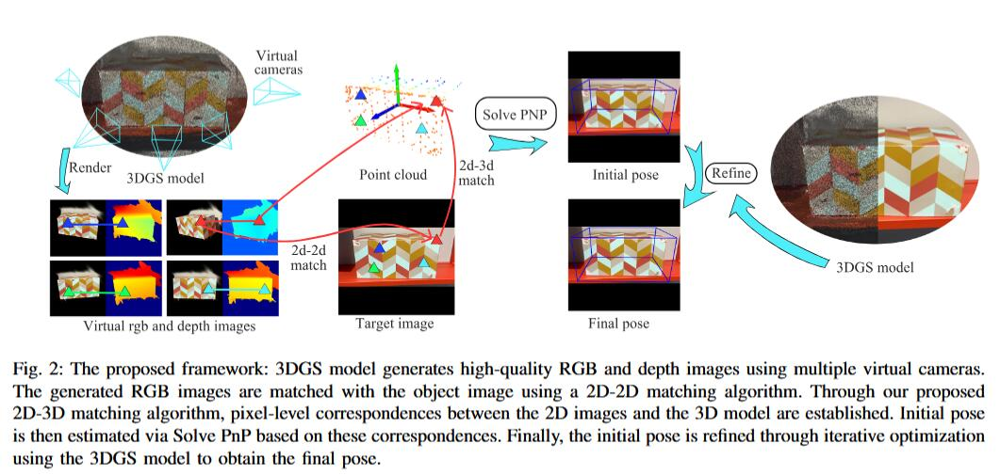
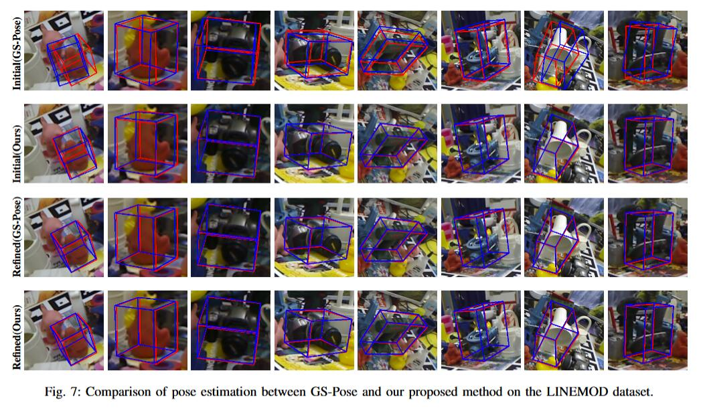

# Accurate One-Shot Object Pose Estimation with Gaussian Splatting Reconstruction




# TODO List

1、3DGS model reconstruction, 6d pose inference and demo code.

2、Pipeline to reproduce the evaluation results on the OnePose dataset and Linemod-Test dataset.

# Installation

```
conda env create -f environment.yaml
conda activate aopgs
```

[LoFTR](https://github.com/zju3dv/LoFTR) , [DeepLM](https://github.com/hjwdzh/DeepLM) , GS-pose are used in this project. Thanks for their great work, and we  appreciate their contribution to the community. Please follow their  installation instructions and LICENSE:

```
git submodule update --init --recursive
pip install submodules/diff-plane-rasterization
pip install submodules/simple-knn
```

[COLMAP](https://colmap.github.io/) is also used in this project for Structure-from-Motion. Please refer to the official [instructions](https://colmap.github.io/install.html) for the installation.

Download the [pretrained models of LoFTR](https://zjueducn-my.sharepoint.com/:f:/g/personal/12121064_zju_edu_cn/EhRhr5PMG-ZLkQjClFCUYhIB_6-307bBmepX_5Cej4Z_wg?e=tSNHMn), including our 2D-3D matching and LoFTR models. Then move them to `${REPO_ROOT}/weights`.

Download the [pretrained weights of GS-pose](https://drive.google.com/file/d/1VgOAemCrEeW_nT6qQ3R12oz_3UZmQILy/view?usp=sharing) and store it as `&{workspace}/gspose_model/model_wights.pth`.

If you encounter environment errors, you can use the environment from [pgsr](https://github.com/zju3dv/PGSR) and gradually add any missing libraries based on the error messages.  Additionally, we have modified the source code of  diff-plane-rasterization, specifically fixing the issue where the  original code couldn't run properly when the camera intrinsic parameters `cx, cy` weren't at the image center. Therefore, you cannot use the original diff-plane-rasterization code.


## Datasets

Our evaluation is conducted on the LINEMOD and OnePose-Test datasets. 

Download link: [LINEMOD-Test](https://bop.felk.cvut.cz/datasets/), [Onepose-Test](https://github.com/zju3dv/OnePose_Plus_Plus/blob/main/doc/dataset_document.md).

LINEMOD-Test dataset is organised under the `dataspace` directory, as below,

```
|--- LINEMOD-test_data
|       |--- id(000001)
|               |--- scene_camera.json
|               |--- depth
|               |--- mask
|                       |--- 000000_000000.png
|                       |--- 000001_000000.png
|                       |--- …….png
|               |--- mask_visib
|               |--- rgb
|                       |--- 000000.png
|                       |--- 000001.png
|                       |--- ……
|               |--- scene_gt.json
|               |--- scene_gt_info.json

```

Onepose-Test dataset is organised under the `dataspace` directory, as below,

```
|--- Onepose_test_data
|       |--- id-objname-category
|               |--- box3d_corners.txt
|               |--- objname-1
|                       |--- Frames.m4v
|                       |--- intrinsics.txt
|                       |--- color
|                       |--- intrin_ba
|                       |--- poses_ba
|                       |--- reproj_box
|               |--- objname-2
```


# Gaussian Splatting model Reconstruction

## Onepose test 

For the OnePose test dataset, the initial point cloud is generated as follows:"

```
cd {workspace}
python preprocess/convert_oneposedata.py --onepose_path ***/test_data --colmap_output_path ***/test_data_sfm
```

For OnePose test's 3DGS model generation, adjust the script paths to match your local directories.

```
cd {workspace}
python preprocess/run_onepose_test_data.py
```

Once finished, the script will create a `test_data_pgsr` folder with the output 3DGS model inside.

## Linemod test

For Linemod test dataset point cloud generation, update the dataset path in `linemod_train.yaml` to your local dataset directory.

```
cd {workspace}
python preprocess/convert_linemodedata.py configs/inference/linemod_train.yaml
```

During 3DGS model generation in OnePose test, you may need to modify the script paths according to your local directory structure.

```
cd {workspace}
python preprocess/run_linemod.py
```

After execution completes, the system will generate a 'linemod_pgsr' folder which includes the output 3DGS model.


# Inference 

## Onepose-test

Onepose-test inference:

```
python inference/inference.py configs/inference/oneposedata_test.yaml
```

在oneposedata_test.yaml文件中需要根据你自己的需要将路径修改为你自己的 `test_data_sfm`,`test_data` 路径。


## Linemod-test

Please modify the `test_data_sfm` and `test_data` paths in  `oneposedata_test.yaml` to match your local directory structure as  needed.


Linemod-test inference(LoFTR):

```
python inference/inference_linemod.py configs/inference/linemod_text_loftr.yaml configs/inference/linemod_train.yaml
```

Linemod-test inference(Superpoint):

```
python inference/inference_linemod.py configs/inference/linemod_text_superpoint.yaml configs/inference/linemod_train.yaml
```

Please update the `test_data_sfm` and `test_data` paths in `inference_linemod.yaml` to match your specific directory structure.

After execution, a `metric_out.txt` file with test results will be  created in both the `test_data_pgsr` and `linemod_pgsr` folders.

The `onepose_out` and `linemod_pose_out` directories contain per-image  visualization outputs and corresponding pose estimation data.



# Acknowledgement

The code is partially based on [DINOv2](https://github.com/facebookresearch/dinov2), [3D Gaussian Splatting](https://github.com/graphdeco-inria/gaussian-splatting?tab=readme-ov-file), [Onepose++](https://zju3dv.github.io/onepose_plus_plus/), [pgsr](https://github.com/zju3dv/PGSR), [gspose](), [LoFTR](https://zju3dv.github.io/loftr/). 


