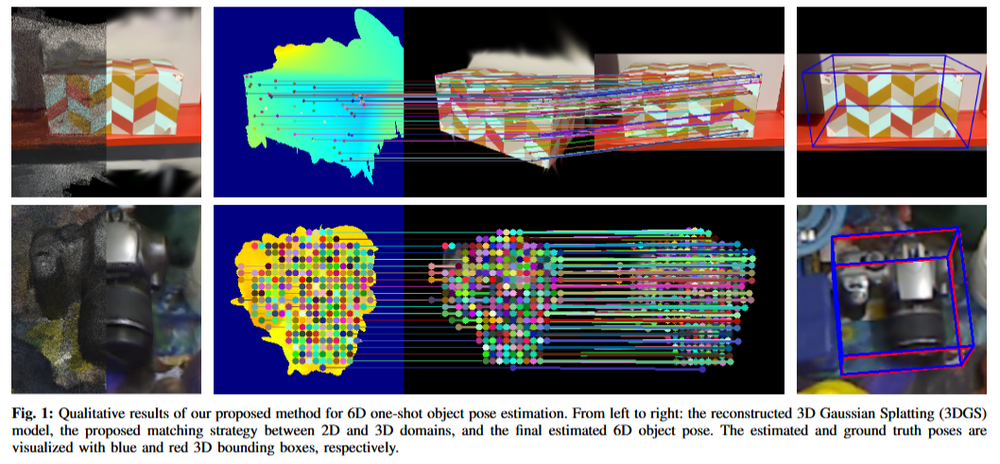

# Accurate One-Shot Object Pose Estimation with Gaussian Splatting Reconstruction





# TODO List

1、3DGS model reconstruction, 6d pose inference and demo code.

2、Pipeline to reproduce the evaluation results on the OnePose dataset and Linemod-Test dataset.

# Installation

```
conda env create -f environment.yaml
conda activate aopgs
```

[LoFTR](https://github.com/zju3dv/LoFTR) , [DeepLM](https://github.com/hjwdzh/DeepLM) , GS-pose are used in this project. Thanks for their great work, and we  appreciate their contribution to the community. Please follow their  installation instructions and LICENSE:

```
git submodule update --init --recursive
pip install submodules/diff-plane-rasterization
pip install submodules/simple-knn
```

[COLMAP](https://colmap.github.io/) is also used in this project for Structure-from-Motion. Please refer to the official [instructions](https://colmap.github.io/install.html) for the installation.

Download the [pretrained models of LoFTR](https://zjueducn-my.sharepoint.com/:f:/g/personal/12121064_zju_edu_cn/EhRhr5PMG-ZLkQjClFCUYhIB_6-307bBmepX_5Cej4Z_wg?e=tSNHMn), including our 2D-3D matching and LoFTR models. Then move them to `${REPO_ROOT}/weights`.

Download the [pretrained weights of GS-pose](https://drive.google.com/file/d/1VgOAemCrEeW_nT6qQ3R12oz_3UZmQILy/view?usp=sharing) and store it as `&{workspace}/gspose_model/model_wights.pth`.

如果环境报错，可以使用[pgsr](https://github.com/zju3dv/PGSR)的环境，根据报错慢慢添加缺少的库。另外，我们更改了diff-plane-rasterization的源代码，具体修复了代码不能使用相机内参`cx,cy`不在图像中心就不能正常运行的问题。所以，不能使用原来的diff-plane-rasterization代码。


## Datasets

Our evaluation is conducted on the LINEMOD and OnePose-Test datasets. 

Download link: [LINEMOD-Test](https://bop.felk.cvut.cz/datasets/), [Onepose-Test](https://github.com/zju3dv/OnePose_Plus_Plus/blob/main/doc/dataset_document.md).

LINEMOD-Test dataset is organised under the `dataspace` directory, as below,

```
|--- LINEMOD-test_data
|       |--- id(000001)
|               |--- scene_camera.json
|               |--- depth
|               |--- mask
|                       |--- 000000_000000.png
|                       |--- 000001_000000.png
|                       |--- …….png
|               |--- mask_visib
|               |--- rgb
|                       |--- 000000.png
|                       |--- 000001.png
|                       |--- ……
|               |--- scene_gt.json
|               |--- scene_gt_info.json

```

Onepose-Test dataset is organised under the `dataspace` directory, as below,

```
|--- Onepose_test_data
|       |--- id-objname-category
|               |--- box3d_corners.txt
|               |--- objname-1
|                       |--- Frames.m4v
|                       |--- intrinsics.txt
|                       |--- color
|                       |--- intrin_ba
|                       |--- poses_ba
|                       |--- reproj_box
|               |--- objname-2
```


# Gaussian Splatting model Reconstruction

## Onepose test 

Onepose test 数据集生成初始点云：

```
cd {workspace}
python preprocess/convert_oneposedata.py --onepose_path ***/test_data --colmap_output_path ***/test_data_sfm
```

onepose test 生成3dgs模型，有可能需要根据你自己电脑的路径更改一下脚本中的路径：

```
cd {workspace}
python preprocess/run_onepose_test_data.py
```

运行结束后，会生成一个`test_data_pgsr`的文件夹，里面包含了生成的3dgs模型。

## Linemod test

Linemod test 数据集生成点云，需要在linemod_train.yaml文件中将数据集路径改成自己电脑上数据集的路径：

```
cd {workspace}
python preprocess/convert_linemodedata.py configs/inference/linemod_train.yaml
```

onepose test 生成3dgs模型，有可能需要根据你自己电脑的路径更改一下脚本中的路径：

```
cd {workspace}
python preprocess/run_linemod.py
```

运行结束后，会生成一个`linemod_pgsr`的文件夹，里面包含了生成的3dgs模型。


# Inference 

## Onepose-test

Onepose-test inference:

```
python inference/inference.py configs/inference/oneposedata_test.yaml
```

在oneposedata_test.yaml文件中需要根据你自己的需要将路径修改为你自己的 `test_data_sfm`,`test_data` 路径。


## Linemod-test

你需要运行[gspose](https://github.com/dingdingcai/GSPose)的代码，然后将它的3dgs模型(3DGO_model.ply)复制到我们输出的linemod_pgsr/(id)/3DGO_model.ply 中。


Linemod-test inference(LoFTR):

```
python inference/inference_linemod.py configs/inference/linemod_text_loftr.yaml configs/inference/linemod_train.yaml
```

Linemod-test inference(Superpoint):

```
python inference/inference_linemod.py configs/inference/linemod_text_superpoint.yaml configs/inference/linemod_train.yaml
```


在inference_linemod.yaml文件中需要根据你自己的需要将路径修改为你自己的 `test_data_sfm`,`test_data` 路径。

运行结束后，会在`test_data_pgsr`和`linemod_pgsr`文件夹目录下生成一个`metric_out.txt`文件，里面包含着测试数据。

在`onepose_out`和`linemod_pose_out`文件夹中包含着每一张图片的可视化信息和位姿预测数据。


# Acknowledgement

The code is partially based on [DINOv2](https://github.com/facebookresearch/dinov2), [3D Gaussian Splatting](https://github.com/graphdeco-inria/gaussian-splatting?tab=readme-ov-file), [Onepose++](https://zju3dv.github.io/onepose_plus_plus/), [pgsr](https://github.com/zju3dv/PGSR), [gspose](), [LoFTR](https://zju3dv.github.io/loftr/). 


